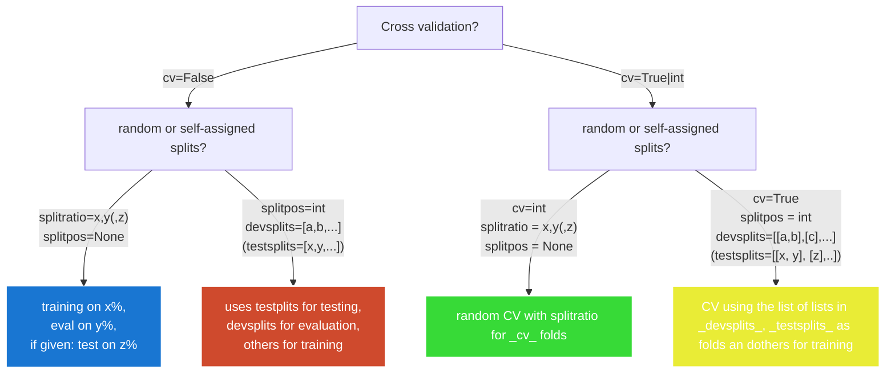

# `rna_protein_xlnet`: A plugin to run bioinformatical language models.

This project implements pre-training and fine-tuning of the [XLNet](https://arxiv.org/abs/1906.08237) language model for the tasks of `regression` and `classification` of RNA and protein sequences. It also supports the extraction of leave-one-out (LOO) scores for fine-tuned models to analyze importance scores of individual inputs.

## Installation

```bash
# Clone the repository with submodules
git clone --recurse-submodules https://github.com/dieterich-lab/rna_protein_xlnet.git
cd rna_protein_xlnet

# Create and activate a virtual environment
python3 -m venv ~/.venvs/xlnet
source ~/.venvs/xlnet/bin/activate

# Install dependencies
pip install pipenv
pipenv install
```

To update the repository and submodules:

```bash
git pull --recurse-submodules
```

## File Structure

```bash
├── exampleconfigs  # Example configurations for experiments
├── src            # Source code for the plugin
```

## Usage

The main script is [xlnet.py](./xlnet.py) which imports the `run()` function from the [biolm._utils](https://github.com/dieterich-lab/biolm_utils) library and provides the custom `Config` object suitable for running the XLNet model. The script can be run via

```bash
python xlnet.py {tokenize, pre-train, fine-tune, predict, interpret} {regression, classification}
```

To get a verbose exlplanation on all the possible parameters you can run the following:

```bash
python xlnet.py {tokenize, fine-tune, predict, interpret} -h 
```

Please adhere to the [example workflow](#example-workflow) to retrace the single steps. For specific usage and information about the configuration parameters we refer the user to the [command line options section](#command-line-options).

## Example config files

We offer two example config files. The first one is for the pipeline of **tokenization**, **pre-training** and **fine-tuning**. The other one is for **predicting** (inference on a test file) and **interpreting** (generation of LOO scores). The latter one is noticeably smaller as all the training cofigurations fall away.

```bash
exampleconfigs
├── tokenize_pre-train_fine-tune.yaml
├── predict_interpret.yaml
```

## Pathing and Results

The software will save all experiment data in the [`outputpath`](#0-designate-an-outputpath) (or fall back to the file path stem of the input file if not given). This directory will be created if not existant. There, we will save the dataset (tokenized samples from the given filepath), the tokenizer and the models. 

### Tokenizing (`tokenize`), pre-training (`pre-train`) and fine-tuning (`fine-tune`):

Assuming we use cross valdiation via 3 splits and having pre-trained/fine-tuned a model, the directory will look as follows (commented are only files concerning your results):

```bash
 
├── pre-train
│   ├── checkpoint-xxx 
│   ├── config.json
│   ├── optimizer.pt
│   ├── preprocessor_config.json
│   ├── pytorch_model.bin
│   ├── rng_state.pth
│   ├── scheduler.pt
│   ├── special_tokens_map.json 
│   ├── tokenizer_config.json
│   ├── tokenizer.json
│   └── train_results.json # training loss
│   ├── trainer_state.json
│   ├── training_args.bin
├── fine-tune
│   ├── 0
│   │   ├── ... # all the same files as in "pre-train"
│   │   ├── all_results.json # combined results for training, evalution & test
│   │   ├── eval_results.json # evaluation results
│   │   ├── rank_deltas.csv # a file showing the rank deltas (i.e. for calculating spearman correlation) for the test data
│   │   ├── test_predictions.csv # the predictions of the model on the test set
│   │   ├── test_results.json # test results 
│   ├── 1
│   │   ├── ... # same as in "0"
│   ├── 2
│   │   ├── ... # same as in "0"
│   └── tboard
│       ├── events.out.tfevents.x.gpu.x # tensorboard runs, showing loss, learning rate and so on
├── tokenize
│   └── logs
│       ├── YY-MM-hh:mm.log # the log files of the your run (or multiple runs)
└── tokenizer.json
```

### Inference (`predict`) and interpration (`interpret`):

Assuming we would use the directory "predictions for `predict` and "looscores" for `interpret`, the the results in the directories will look as follows:

```bash
predictions
├── dataset.json  # saved dataset for quicker load when run multiple times (can be deleted)
├── logs # log folder
├── rank_deltas.csv # file denoting the spearman rank for each sample
└── test_predictions.csv # file denoting the prediction for each sample
```

```bash
looscores
├── dataset.json  # saved dataset for quicker load when run multiple times (can be deleted)
├── logs # log folder
├── loo_scores_remove.csv # the .csv file containing the results . Header is `sequence,token,label,pred,start_offset,end_offset,loo`
└── loo_scores_remove.pkl # same as above, but as `shap.Explanation` object for easier analysis with the `shap` library.
```

The header of the `loo_scores_{handletokens}.csv` can be read as follows:
- `sequence`: The sequence id / identifier
- `token`: the actual token (for `remove` it was deleted from the sequence, for `mask` it's one-hot encoding was set to zero, for `replace` it was replaced with the token under `replacement`, see below)
- `replacement`: Only valid for `handletokens: replace`, see above
- `label`: The true regression value / class
- `pred`: The predicted regression value / class
- `start_offset`: Start offset in the sequence (zero-indexed)
- `end_offset`: End offset in the sequence (zero-indexed). Example: The `a` in `cgat` would have start/end index of (2, 3)
- `loo`: The loo score: positive means, the prediction increased for the value of `loo`, negative means, the predictions decreased for that amount

## Example workflow

This tutorial will lead you through an end-to-end process of training a tokenizer and fine-tuning a model. When you have questions about the arguments used here, you can read in detail about them in the [command line options](#command-line-options) section of this README.

### 0) Designate an Outputpath

First off and simple, you can provide a path where to save your experiments (see [Pathing and Results](#pathing-and-results)):

```yaml
#
# Below is the experimentname; an identifier that will make your experiment re-usable.
#
outputpath: experiments/rna_xlnet  # If empty, will be set to the file name (without extension)
```

### 1) Data Configuration

We designed options to give varying data sources for either tokenzation/pre-training and fine-tuning (if you are using the same files both steps, just mirror the parameters accordingly). You also have to let the scripts know where exactly to find information about labels, sequences and splits in your data file. The two according sections in the config file are listed below. Attributes should be self-explanatory by their comments or explained by the command line parser. (see [usage](#usage)). 
```yaml
#
# Description of the datasource used for 
# - training the tokenizer 
# - pre-training (for LM)
#
tokenizing and pre-training data source:
  filepath: "tokenizing_data_file.txt" # this is the path to the file that you use to learn the tokenizer.
  stripheader: False # if this data file has a header that has to be stripped.
  columnsep: "\t" # could be [",", "|", "\t", ...] This denominates field separator.
  tokensep: "," # This denominates how input tokens are concatenated (use "" or `False` if your input sequence is a conesecutive string of tokens).
  idpos: 1 # Position of the identifier column of your data, e.g. "ENST00000488147", which will be printed out in the inference/interepret results.
  seqpos: 1 # Position of the actual sequence in your file (your "input data").
  ```

Once again, if your fine-tuning data is the one you learned the tokenizer from, please mirror the entries from above to the below segment in the yaml file.

```yaml
#
# Description of the fine-tuning source
#
fine-tuning data source:
  filepath: "fine-tuning_data_file.txt" # this is the path to the file that you use to learn the tokenizer.
  stripheader: False # if the custom data file has a header that has to be stripped.
  columnsep: "\t" # could be [",", "|", "\t", ...] This denominates field separator.
  tokensep: "," # This denominates how input tokens are concatenated (use "" or `False` if your input sequence is a conesecutive string of tokens).
  idpos: 1 # Position of the identifier column of your data, e.g. "ENST00000488147", which will be printed out in the inference/interepret results.
  seqpos: 1 # Position of the actual sequence in your file (your "input data").
  labelpos: 1 # Position of the label column.
  ... # further parameters explained later
  ```

A prototypical dataset file would look like this (without header)

```csv
0	ENST00000488147	ENSG00000227232	653635	WASH7P	unprocessed_pseudogene	0.204213162843933	3.39423360819142	0.121582579281952	0.374739086478062	a,t,g,g,g,a,g,c,c,g,t,g,t,g,c,a,c,g,t,c,g,g,g,a,g,c,t,c,g,g,a,g,t,g,a,g,c,gej,c,a,c,c,a,t,g,a,c,t,c,c,t,g,t,g,a,g,g,a,t,g,c,a,g,c,a,c,t,c,c,c,t,g,g,c,a,g,g,t,c,a,g,a,c,c,t,a,t,g,c,c,g,t,g,c,c,c,t,t,c,a,t,c,c,a,g,c,c,a,g,a,c,c,t,g,c,g,g,c,g,a,g,a,g,g,a,g,g,c,c,g,t,c,c,a,g,c,a,g,a,t,g,g,c,g,g,a,t,g,c,c,c,t,g,c,a,g,t,a,c,c,t,g,c,a,g,a,a,g,g,t,c,t,c,t,g,g,a,g,a,c,a,t,c,t,t,c,a,g,c,a,g,gej,t,a,g,a,g,c,a,g,a,g,c,c,g,g,a,g,c,c,a,g,g,t,g,c,a,g,g,c,c,a,t,t,g,g,a,g,a,g,a,a,g,g,t,c,t,c,c,t,t,g,g,c,c,c,a,g,g,c,c,a,a,g,a,t,t,g,a,g,a,a,g,a,t,c,a,a,g,g,g,c,a,g,c,a,a,g,a,a,g,g,c,c,a,t,c,a,a,g,gej,t,g,t,t,c,t,c,c,a,g,t,g,c,c,a,a,g,t,a,c,c,c,t,g,c,t,c,c,a,g,g,g,c,g,c,c,t,g,c,a,g,g,a,a,t,a,t,g,g,c,t,c,c,a,t,c,t,t,c,a,c,g,g,g,c,g,c,c,c,a,g,g,a,c,c,c,t,g,g,c,c,t,g,c,a,g,a,g,a,c,g,c,c,c,c,c,g,c,c,a,c,a,g,g,a,t,c,c,a,g,a,g,c,a,a,g,c,a,c,c,g,c,c,c,c,c,t,g,g,a,c,g,a,g,c,g,g,g,c,c,c,t,g,c,a,g,gej,a,g,a,a,g,c,t,g,a,a,g,g,a,c,t,t,t,c,c,t,g,t,g,t,g,c,g,t,g,a,g,c,a,c,c,a,a,g,c,c,g,g,a,g,c,c,c,g,a,g,g,a,c,g,a,t,g,c,a,g,a,a,g,a,g,g,g,a,c,t,t,g,g,g,g,g,t,c,t,t,c,c,c,a,g,c,a,a,c,a,t,c,a,g,c,t,c,t,g,t,c,a,g,c,t,c,c,t,t,g,c,t,g,c,t,c,t,t,c,a,a,c,a,c,c,a,c,c,g,a,g,a,a,c,c,t,gej,t,a,g,a,a,g,a,a,g,t,a,t,g,t,c,t,t,c,c,t,g,g,a,c,c,c,c,c,t,g,g,c,t,g,g,t,g,c,t,g,t,a,a,c,a,a,a,g,a,c,c,c,a,t,g,t,g,a,t,g,c,t,g,g,g,g,g,c,a,g,a,g,a,c,a,g,a,g,g,a,g,a,a,g,c,t,g,t,t,t,g,a,t,g,c,c,c,c,c,t,t,g,t,c,c,a,t,c,a,g,c,a,a,g,a,g,a,g,a,g,c,a,g,c,t,g,g,a,a,c,a,g,c,a,g,gej,t,c,c,c,a,g,a,g,a,a,c,t,a,c,t,t,c,t,a,t,g,t,g,c,c,a,g,a,c,c,t,g,g,g,c,c,a,g,g,t,g,c,c,t,g,a,g,a,t,t,g,a,t,g,t,t,c,c,a,t,c,c,t,a,c,c,t,g,c,c,t,g,a,c,c,t,g,c,c,c,g,g,c,a,t,t,g,c,c,a,a,c,g,a,c,c,t,c,a,t,g,t,a,c,a,t,t,g,c,c,g,a,c,c,t,g,g,g,c,c,c,c,g,g,c,a,t,t,g,c,c,c,c,c,t,c,t,g,c,c,c,c,t,g,g,c,a,c,c,a,t,t,c,c,a,g,a,a,c,t,g,c,c,c,a,c,c,t,t,c,c,a,c,a,c,t,g,a,g,g,t,a,g,c,c,g,a,g,c,c,t,c,t,c,a,a,g,aej,c,c,t,a,c,a,a,g,a,t,g,g,g,g,t,a,c,t,a,a,c,a,c,c,a,c,c,c,c,c,a,c,c,g,c,c,c,c,c,a,c,c,a,c,c,a,c,c,c,c,c,a,g,c,t,c,c,t,g,a,g,g,t,g,c,t,g,g,c,c,a,g,t,g,c,a,c,c,c,c,c,a,c,t,c,c,c,a,c,c,c,t,c,a,a,c,c,g,c,g,g,c,c,c,c,t,g,t,a,g,g,c,c,a,a,g,g,c,g,c,c,a,g,g,c,a,g,g,a,c,g,a,c,a,g,c,a,g,c,a,g,c,a,g,c,g,c,g,t,c,t,c,c,t,t,c,a,g,tej,c,c,a,g,g,g,a,g,c,t,c,c,c,a,g,g,g,a,a,g,t,g,g,t,t,g,a,c,c,c,c,t,c,c,g,g,t,g,g,c,t,g,g,c,c,a,c,t,c,t,g,c,t,a,g,a,g,t,c,c,a,t,c,c,g,c,c,a,a,g,c,t,g,g,g,g,g,c,a,t,c,g,g,c,a,a,g,g,c,c,a,a,g,c,t,g,c,g,c,a,g,c,a,t,g,a,a,g,g,a,g,c,g,a,a,a,g,c,t,g,g,a,g,a,a,g,c,a,g,c,a,g,c,a,g,a,a,g,g,a,g,c,a,g,g,a,g,c,a,a,g,tej,g,a,g,a,g,c,c,a,c,g,a,g,c,c,a,a,g,g,t,g,g,g,c,a,c,t,t,g,a,t,g,t,c,gej,c,t,c,c,a,t,g,g,g,g,g,g,a,c,g,g,c,t,c,c,a,c,c,c,a,g,c,c,t,g,c,g,c,c,a,c,t,g,t,g,t,t,c,t,t,a,a,g,a,g,g,c,t,t,c,c,a,g,a,g,a,a,a,a,c,g,g,c,a,c,a,c,c,a,a,t,c,a,a,t,a,a,a,g,a,a,c,t,g,a,g,c,a,g,a,a,a
```

### 2) Tokenization

During tokenization the input sequences will be split into sub-tokens by using [byte pair encoding](https://aclanthology.org/P16-1162/) or split token-/characterwise (`atomic`). To train a tokenizer, you'll beusing the `tokenize` mode:

```bash
python xlnet.py tokenize --configfile exampleconfigs/tokenize_pre-train_fine-tune.yaml
```

All options but `samplesize` refer to the byte pair encoding process to set up the resulting vocabulary, where es the former can be used to downsample your file for learning the tokenizer if it is huge.

```bash
#
# If you want to tokenize, you only need to specify the following.
#
tokenization:
  samplesize: # if your data is to big to learn a tokenizer, you can downsample it
  vocabsize: 20_000 # the maximum size of the vocabulary which will not be exceeded.
  minfreq: 2 # the minimum frequency of a token before being removed from the vocabulary.
  atomicreplacements: # dictionary of replacements, i.e. `{"a": "A", "bcd": "xyz"}.
  encoding: bpe # [bpe, atomic]
  bpe: 
    maxtokenlength: 10 # the maximum length allowed for sub-tokens.
  lefttailing: True # If true, the sequences will be cut from the left (begginnig from the right end). If false, sequences will cut from the right end of the sequence.
```

### 3) Pre-training

After tokenization, we will pre-train a model on unlabeled data via masked language modelling - or more specific: permutation language modelling. To do so, we will simply use the pre-train mode:

```bash
python xlnet.py pre-train --configfile exampleconfigs/tokenize_pre-train_fine-tune.yaml
```

#### Pretrainedmodel

Without a specified `pretrainedmodel` the tokenizer from the current experiment's folder is loaded. If `pretrainedmodel` is set to the parent folder of a different experiment, the tokenizer from that folder is loaded.

```yaml
tokenizing and pre-training data source:
  ...
  pretrainedmodel: path/to/pretrainedmodel
  ...
```
#### Special Configurations

In your config file you can make certain modifications to the training `settings`:

> **Attention**: Do not change the `blocksize` as this is the default sequence length for the CNN-RNN to function properly.

```yaml
settings:
  data pre-processing:
    centertoken: False # either False or a character on which the sequence will be centered. The sequence will be equally cut from both sides (in best case: 255 left - centertoken - 255 right). If there's still space left for input tokens, we first add all remaining from the left, then from the right side of the centertoken.
  environment:
    ngpus: 1 # [1, 2, 4] # under development: automatically infer this from the environment
  training:
    general:
      batchsize: 8 # This is the batch size. (effective gradients will be batchsize x gradacc, see below)
      gradacc: 4 # Gradient accumulation: Determines how many batches of gradients should be aggregated (effective gradients will be batchsize x gradacc)
      blocksize: 512 # DO NOT CHANGE. This is the default sequence length for our language models.
      nepochs: 10 # Number of epochs the model iterates over the training dataset.
      resume: False # When a training was cancelled (resuming) or further fine-tuning (see `python xlnet.py pre-train -h` for detailed help)
```

### 4) Fine-tuning a model

For fine-tuning a model, the `fine-tune` mode is required:

```bash
python xlnet.py fine-tune --task {regression, classification} --configfile exampleconfigs/tokenize_pre-train_fine-tune.yaml
```

#### Pretrainedmodel

Without a specified `pretrainedmodel` the model from the current experiment's folder is loaded. If `pretrainedmodel` is set to the parent folder of a different experiment, the pretrainedmodel from that folder is loaded. You can set it here:

```yaml
fine-tuning data source:
  ...
  pretrainedmodel: path/to/pretrainedmodel
  ...
```

#### Cross validation and data splits

We assist with multiple preconfigured modi how you can configure the training, validation and test splits. We also offer the possibility for automatic cross validation.

To trigger these, you have to fill in these information in the configfile:

```yaml
fine-tuning data source:
  ... 
  crossvalidation: False # trigger if cross-validation is desired. If set to `0`, no cross-validation is performed. If set to `True`, cross-validation is performed on the predifined splits in the data file, taking each split as a test set once. If set to an integer `x`, `x`-fold cross-validation is performed on random splits determined by `splitratio`.
  splitratio: False # Comma-seprated list describing the desired split ratio for train, validation and (possibly) test split for both cross-validation and non-cross-validation. Format is `train_percentage/val_percentage(/test_percentage)`, e.g. `85,15` or `70,20,10`. Must sum up to 100 (see default). Given a third splitratio triggers testing on that split. Will be overruled in case `splitpos` parameter is set.
  splitpos: False # int or `False` (if no splits are defined in the data file). `splitpos` will always overrule `splitratio`. Denotes the column in the data file where the split identifier is defined. If set to `True`, the split identifier is expected to be in the first column of the data file, i.e. the first column is expected to contain the split identifier. For non-cross-validation `devsplits` and `testsplits` must be set to use the splits.
  devsplits: False # a list, e.g. `[1, 2, ..]` to denote the splits that should be used for validation. `splitpos` must be set for this to work.
  testsplits: False # a list, e.g. `[1, 2, ..]` to denote the splits that should be used for validation. Setting this parameter will trigger testing on these splits. `splitpos` must be set for this to work.
```

The following graph depicts the four possible scenarios:


Explained in words, this converges to:

- <span style="color:blue">BLUE</span>: **Training on random splits**. Requirements:
  - `cv=False` (no cross validation). 
  - `splitratio=x,y(,z)` (must be 2 or 3 comma-separated integers that sum up to 100)
  - `splitpos=None`(no custom splits)

  Training on `x`% random samples, evaluation on `y`% random samples. If three integers are given (`x`,`y`,`z`), we also test on `z`% random samples.

- <span style="color:red">RED</span>: **Training on custom splits**. Reuirements:
  - `cv=False` (no cross validation). 
  - `splitpos=int`(training on dedicated splits, where `int` is the split denominator in the file)
  - `devsplits=[a,b,...]`(splits for validation)
  - (`testsplits=[x,y,...]`(if given, splits for testing)

  We validate on all `a,b,...` splits given with `devsplits` and train all other splits. If given, testing is done on the the given `testsplits`. 

- <span style="color:green">GREEN</span>: **Cross validation on random splits**. Requirements:
  - `cv=int` (number of folds to carry out cross validation). 
  - `splitratio=x,y(,z)` (must be 2 or 3 comma-separated integers that sum up to 100)
  - `splitpos=None`(no custom splits)

  Training for `cv` folds on `x`% random samples, evaluation on `y`% random samples. If three integers are given (`x`,`y`,`z`), we also test on `z`% random samples. For all folds, the data gets randomly shuffled.

- <span style="color:yellow">YELLOW</span>: **Cross validation using custom split sets**. Requirements:
  - `cv=True` (activating cross validation). 
  - `splitpos=int`(training on dedicated splits, where `int` is the split denominator in the file)
  - `devsplits=[[a,b],[c],...]`(splits for validation)
  - (`testsplits=[[x,y],[z],...]`(if given, splits for testing)

  Cross validation is performed on the custom split sets. If `testsplits` is set, this triggers testing on these splits. `devsplits` and `testsplits` must have the same length to be zipped.

### 5) Inference (predicting)

Now that you've trained a model (new models) you probably want to make predictions on new data. To do so, you can use `predict` mode with the `--task` flag of choice (`{classification, regression}`): 

```bash
python xlnet.py predict --task {regression, classification} --configfile exampleconfigs/predict_interpret.yaml
```

As a lot of the training parameters are obsolete for pure inference, we provide a [slimmer inference config file](exampleconfigs/predict_interpret.yaml) for this purpose. It's now all about declaring the structure of the new data source, where to save the results and where to find the trained model to infer from. The latter will point  to a folder, where all the model specific files are stored (like `pytorch_model.bin` and so on, see [Pathing and Results](#pathing-and-results)):

```yaml
outputpath: "test_folder"  # If empty, will be set to the file name (without extension)

inference data source:
  filepath: "data_to_be_predicted_or_to_be_inferred_from.txt"
  stripheader: False # if the custom data file has a header that has to be stripped
  columnsep: "\t" # could be "," "|", "\t" ...
  tokensep: ","
  idpos: 1 # position of the identifier of the column 
  seqpos: 2 # position of the sequence column 
  labelpos: 3 # if the file has ground truth labels, this is the position of the label column (else delete or leave empty)

#
# State the encoding of the pretrained model
#
tokenization:
  encoding: bpe # [bpe, ataomic]

inference model:
  pretrainedmodel: "path/to/fine-tuned-model" # path of the fine-tuned model to infer from

#
# Genral settings for model predictons.
#
settings:
  data pre-processing:
    centertoken: False # either False or a character on which the sequence will be centered. The sequence will be equally cut from both sides (in best case: 255 left - centertoken - 255 right). If there's still space left for input tokens, we first add all remaining from the left, then from the right side of the centertoken.
  environment:
    ngpus: 1 # [1, 2, 4] # TODO: automatically infer this from the environment
  training:
    batchsize: 8
    blocksize: 512 # DO NOT CHANGE. This is the default encoding length for XLNET.
    scaling: log # label scaling [log, minmax, standard]
```

### 6) Interpretation

As a last step, you certainly want to get intepretations for your predictions.  To do so, you can use `interpret` mode with the `--task` flag of choice (`{classification, regression}`): 

```bash
python xlnet.py interpret --task {regression, classification} --configfile exampleconfigs/predict_interpret.yaml
```

Similar to [inference](#4-inference-predicting), most of the training parameters are obsolete, so we provide a [slimmer inference config file](exampleconfigs/predict_interpret.yaml). For Interpretability, we resort to [leave-one-out scores](https://aclanthology.org/N19-1357.pdf). "Leaving out" a token can be handled in three different ways:

- `remove`: The token will be completely removed from the sequence.
- `mask`: The token will be replaced with the tokenizer's `[MASK]` token.
- `replace`: The token will be exchanged for against other tokens specified by `replacementdict`. In the example below, `a` is replaced against `[b, c]`, `b` against `[a, c]` and so on.
- `replacementdict`: # Dict of lists of atomic tokens that should be replaced against each other if `--handletokens` is set to `replace`. Must be convertible into a valid python dictionarye,.g.: '{"A": ["a", "c", "g", "t"], "a": ["A", "C", "G", "T"], "AEJ": ["aej", "cej", "gej", "tej"], "aej": ["AEJ", "CEJ", "GEJ", "TEJ"]}'

As for inference, in the config file you should declare the new data source, where to save the results and where to find the trained model to infer from. 

> **Attention**: Although the calculation of LOO scores is batched, it is still fairly expensive:
>
>    - For `remove`/`mask`: In a sequence of 1,000 tokens each token will either be removed or replaced its one-hot-vector set to zero which results in 1,000 samples for single sequence.
>    - For `replace`: In a sequence of 1,000 tokens each token will be replaced by X mutual tokens, resulting in 1,000 * X samples.

```yaml
outputpath: "test_folder"  # If empty, will be set to the file name (without extension)

inference data source:
  filepath: "data_to_be_predicted_or_to_be_inferred_from.txt"
  stripheader: False # if the custom data file has a header that has to be stripped
  columnsep: "\t" # could be "," "|", "\t" ...
  tokensep: ","
  specifiersep:
  idpos: 1 # position of the identifier of the column 
  seqpos: 2 # position of the sequence column 
  labelpos: 3 # if the file has ground truth labels, this is the position of the label column (else delete or leave empty)

#
# State the encoding of the pretrained model
#
tokenization:
  encoding: bpe # [bpe, atomic]

inference model:
  pretrainedmodel: "path/to/fine-tuned-model" # path of the fine-tuned model to infer from

#
# Genral settings for model predictons.
#
settings:
  data pre-processing:
    centertoken: False # either False or a character on which the sequence will be centered
  environment:
    ngpus: 1 # [1, 2, 4] # TODO: automatically infer this from the environment
  training:
    batchsize: 8
    blocksize: 512 # DO NOT CHANGE. This is the default encoding length of XLNET.
    scaling: log # label scaling [log, minmax, standard]

#
# Interpretation settings
#
looscores:
  handletokens: remove # One of [remove, mask, replace]. This determines how to treat the absence of a token during leave-one-out calculation.
  replacementdict: #  # List of lists of atomic tokens that should be replaced against each other if `--handletokens` is set to `replace`. Must be convertible into a valid python dictionarye,.g.: '{"A": ["a", "c", "g", "t"], "a": ["A", "C", "G", "T"], "AEJ": ["aej", "cej", "gej", "tej"], "aej": ["AEJ", "CEJ", "GEJ", "TEJ"]}'
```